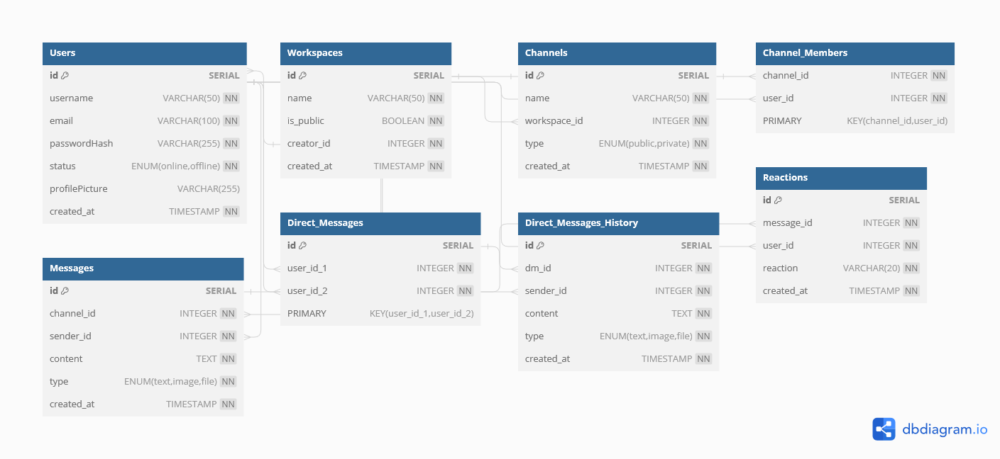

# Slack DataBase Schema

****📕 **Topic name:**  Slack DataBase Schema

 🖥️ **Subject:**  NoSQL | Final

 🗓️ **Created_at:**  04.03.24

 **🎯 Aims of the assignment:** 

This assignment aims to challenge you to apply database design principles and MongoDB functionalities to create a scalable and efficient data structure for a real-time messaging application.

# Introduction

## What is Slack ?

Slack is a **business communication** platform designed to **streamline communication and collaboration** within teams. It goes beyond traditional email and meetings by offering a **centralized hub** for **messaging, file sharing, voice and video calls, and app integrations**.

## Here are some key features of Slack:

- **Channels:** Create dedicated spaces for specific projects, teams, or topics, allowing for focused discussions.
- **Direct Messaging:** Have private conversations with individuals or small groups.
- **Threaded Conversations:** Respond to specific messages within a conversation, keeping discussions organized.
- **Search:** Easily find past conversations, messages, and files using powerful search capabilities.
- **Integrations:** Connect with various third-party apps and tools to enhance functionality, such
as project management, document sharing, and more.
- **Notifications:** Stay informed about new messages, mentions, and other events through desktop and mobile notifications.
- **File Sharing:** Share documents, images, and other files directly within conversations.
- **Voice and Video Calls:** Make voice and video calls directly within the platform for seamless communication.
- **User Presence:** See if your colleagues are online and available for communication.

# Database Scheme



## **Tables and their Properties:**

### **1. Users:**

- **Table:** Stores user information like username, email, password (hashed), status (online/offline), profile picture, and creation date.
- **Properties:**
    - **id (primary key):** Unique identifier for each user (often an auto-incrementing integer).
    - **username:** Text field for the user's chosen username (unique).
    - **email:** Text field for the user's email address (unique).
    - **passwordHash:** Text field storing a secure hash of the user's password.
    - **status:** Text field with possible values like "online", "offline", etc.
    - **profilePicture:** Text field containing a URL or path to the user's profile picture (optional).
    - **created_at:** Date/Time field indicating when the user account was created.

### **2. Workspaces (Optional):**

- **Table:** Stores information about workspaces users can join for organized communication (if applicable).
- **Properties:**
    - **id (primary key):** Unique identifier for each workspace.
    - **name:** Text field for the workspace name (unique).
    - **is_public:** Boolean field indicating if the workspace is public or private.
    - **creator_id:** Foreign key referencing the user who created the workspace.
    - **created_at:** Date/Time field indicating when the workspace was created.

### **3. Channels:**

- **Table:** Stores information about communication channels within workspaces (or globally if no workspaces).
- **Properties:**
    - **id (primary key):** Unique identifier for each channel.
    - **name:** Text field for the channel name.
    - **workspace_id (foreign key):** (Optional) References the workspace the channel belongs to (if applicable).
    - **type:** Text field indicating the channel type (public or private).
    - **created_at:** Date/Time field indicating when the channel was created.

### **4. Channel Members (Many-to-Many Relationship):**

- **Table:** This table is used for many-to-many relationships, linking users to channels they are members of.
- **Properties:**
    - **channel_id:** Foreign key referencing the channel's ID.
    - **user_id:** Foreign key referencing the user's ID.
    - **Primary Key:** Combination of `channel_id` and `user_id` (ensures each user belongs to a channel only once).

### **5. Messages:**

- **Table:** Stores information about messages sent within channels or direct messages.
- **Properties:**
    - **id (primary key):** Unique identifier for each message.
    - **channel_id (foreign key):** References the channel where the message was sent.
    - **sender_id (foreign key):** References the user who sent the message.
    - **content:** Text field containing the message content.
    - **type:** Text field indicating the message type (text, image, file, etc.).
    - **created_at:** Date/Time field indicating when the message was sent.
    - **parent_id (foreign key - optional):** References another message for threaded replies.

### **6. Direct Messages (Optional):**

- **Table (Many-to-Many Relationship):** This table can be used for direct messaging functionality (if applicable).
- **Properties:**
    - **user_id_1:** Foreign key referencing the first user in the direct message conversation.
    - **user_id_2:** Foreign key referencing the second user in the direct message conversation.
    - **Primary Key:** Combination of `user_id_1` and `user_id_2` (ensures a unique conversation between two users).

### **7. Direct Messages History:**

- **Table:** Stores individual messages exchanged in direct message conversations (if applicable).
- **Properties:**
    - **id (primary key):** Unique identifier for each direct message.
    - **dm_id (foreign key):** References the unique identifier of the direct message conversation (from Direct Messages table).
    - **sender_id (foreign key):** References the user who sent the message.
    - **content:** Text field containing the message content.
    - **type:** Text field indicating the message type (text, image, file, etc.).
    - **created_at:** Date/Time field indicating when the direct message was created.

### **8. Reactions:**

- **Table:** Stores information about reactions users give to messages (e.g., "like", "thumbs up", etc.).
- **Properties:**
    - **id (primary key):** Unique identifier for each reaction.
    - **message_id (foreign key):** References the message the reaction is associated with.
    - **user_id (foreign key):** References the user who added the reaction.
    - **reaction:** Text field specifying the type of reaction (e.g., "like", "joy", "fire").
    - **created_at:** Date/Time field indicating when the reaction was added.

# Technology Stack

The **MERN stack** is a popular choice for building real-time web applications like Slack due to its flexibility, scalability, and developer-friendly nature. Here's an overview of how this stack can be used for this project:

## **MERN Stack Components:**

- **M:** MongoDB - **NoSQL database:**
    - Stores the application data in a flexible and scalable schema, ideal for real-time communication and frequent updates.
    - MongoDB's document-oriented structure
    allows for storing diverse data types within each document, making it
    well-suited for user information, messages, and other dynamic data.
- **E:** Express.js - **JavaScript framework:**
    - Provides a robust foundation for building the backend server application.
    - Express.js offers features like
    routing, middleware, and templating, allowing developers to handle
    incoming requests, process data, and generate dynamic responses.
- **R:** React.js - **JavaScript library:**
    - Used to build the user interface (UI) of the application.
    - React's component-based architecture promotes modularity, reusability, and efficient UI development.
- **N:** Node.js - **JavaScript runtime environment:**
    - Enables running JavaScript code outside
    the browser, powering both the backend server and the frontend (using
    libraries like React).

# **Initializing a MERN Stack Project**

## **1. Project Setup:**

- **Prerequisites:**
    - Node.js and npm (or yarn) installed on your system.
    - A code editor or IDE of your choice.
- **Create a project directory and initialize project:**
    
    ```bash
    mkdir slack-clone; cd slack-clone
    npm init -y
    ```
    
- **Install dependencies:**
    
    ```bash
    npm install express mongoose react react-dom socket.io cors
    ```
    
    This installs essential libraries for the backend (Express, Mongoose), frontend (React, ReactDOM), real-time communication ([Socket.IO](http://socket.io/)), and cross-origin resource sharing (CORS).
    

## **2. Folder Structure:**

```
slack-nosql/
├── package.json
├── server.js  # Backend server file
└── client/
    ├── src/
    │   ├── App.js  # React application entry point
    │   └── ...  # Other React components and code
    ├── public/  # Static assets like images and fonts
    └── index.html  # HTML file for rendering the React app
```

## **3. Server-side (Node.js and Express):**

**`server.js:`**

```jsx
const express = require('express');
const app = express();
const http = require('http').createServer(app);
const io = require('socket.io')(http);
const mongoose = require('mongoose');

// Database connection (replace with your MongoDB connection string)
mongoose.connect('mongodb://localhost:27017/slack-clone', {
  useNewUrlParser: true,
  useUnifiedTopology: true
});

// Define routes and middleware (not included here for brevity)

// Socket.io connection handling and real-time communication (not included here)

http.listen(3000, () => {
  console.log('Server listening on port 3000');
});

```

## **4. Client-side (React):**

**`client/src/App.js:`**

```jsx
import React, { useState, useEffect } from 'react';
import io from 'socket.io-client';

const socket = io('http://localhost:3000'); // Connect to server

function App() {
  const [messages, setMessages] = useState([]);

  useEffect(() => {
    // Handle receiving messages from server using socket events
    socket.on('message', (message) => {
      setMessages([...messages, message]);
    });
  }, [messages]);

  // Handle sending messages to server (not included)

  return (
    <div>
      {/* Display messages and chat interface (not included) */}
    </div>
  );
}

export default App;
```

# Creating models for our tables in DB:

### **1. User.js:**

```jsx
const mongoose = require('mongoose');

const userSchema = new mongoose.Schema({
  username: { type: String, required: true, unique: true },
  email: { type: String, required: true, unique: true },
  passwordHash: { type: String, required: true },
  status: { type: String, enum: ['online', 'offline'], default: 'offline' },
  profilePicture: { type: String, default: null },
  createdAt: { type: Date, default: Date.now },
});

module.exports = mongoose.model('User', userSchema);
```

### 2. **Channel.js:**

```jsx
const mongoose = require('mongoose');

const channelSchema = new mongoose.Schema({
  name: { type: String, required: true },
  workspaceId: { type: mongoose.Schema.Types.ObjectId, ref: 'Workspace' }, // Optional: reference to workspace
  type: { type: String, enum: ['public', 'private'], default: 'public' },
  creatorId: { type: mongoose.Schema.Types.ObjectId, ref: 'User', required: true },
  createdAt: { type: Date, default: Date.now },
  members: [{ type: mongoose.Schema.Types.ObjectId, ref: 'User' }], // Array of user IDs
});

module.exports = mongoose.model('Channel', channelSchema);
```

### 3. **Message.js:**

```jsx
const mongoose = require('mongoose');

const messageSchema = new mongoose.Schema({
  channelId: { type: mongoose.Schema.Types.ObjectId, ref: 'Channel', required: true },
  senderId: { type: mongoose.Schema.Types.ObjectId, ref: 'User', required: true },
  content: { type: String, required: true },
  type: { type: String, enum: ['text', 'image', 'file'], default: 'text' },
  parentId: { type: mongoose.Schema.Types.ObjectId, ref: 'Message' }, // Optional: for threaded replies
  reactions: { type: Object, default: {} }, // Stores user reactions to the message
  createdAt: { type: Date, default: Date.now },
});

module.exports = mongoose.model('Message', messageSchema);
```

This is a basic example, and you might need to add additional fields, validations, and relationships depending on your specific requirements. Remember to adjust the models and relationships based on your chosen database management system and application functionalities.

# React Components:

- CreateMessageForm - to send a message with a textual body and trigger typing indicators.
- CreateRoomForm - to create a new room and join it upon creation.
- FileInput - to send a message with a rich media attachment.
- Message - to render out a message that potentially includes an attachment.
- MessageList - to render a list of messages from a key value store.
- RoomHeader - to display useful information about a given room.
- RoomList - to render a list of rooms which can be subscribed to by the current user.
- TypingIndicator - to signify to the user that another user is typing in a given room.
- UserHeader - to display useful information about a given user.

# API Routes:

```jsx
const express = require('express')

const router = express.Router()
const passport = require('passport')

const models = require('../models')

router.post('/register', passport.authenticate('local-signup'), (req, res) => {
  res.json(req.user)
})

router.post(
  '/authenticate',
  passport.authenticate('local-login'),
  (req, res) => {
    res.json(req.user)
  }
)

router.post('/logout', (req, res) => {
  if (!req.user) return res.status(500).json({ error: true })

  req.logout()
  res.json({ success: true })
})

router.get('/users', (req, res) => {
  if (!req.user) return res.status(401).end()

  models.User.find(
    {},
    { 'local.username': 1, 'local.online': 1, _id: 0 },
    (err, users) => {
      if (err) {
        return res.status(500).json({ error: true })
      }

      res.json(users)
    }
  )
})

router.get('/username/:username', (req, res) => {
  req.params.username = req.params.username.toLowerCase()

  models.User.findOne(
    { 'local.username': req.params.username },
    (err, user) => {
      if (err) {
        return res.status(500).json({ error: true })
      }

      return res.json({ alreadyInUse: !!user })
    }
  )
})

router.get('/user/channels', (req, res) => {
  if (!req.user) return res.status(401).end()

  models.User.findOne(
    { 'local.username': req.user },
    { 'local.channels': 1, _id: 0 },
    (err, channels) => {
      if (err) {
        return res.status(500).json({ error: true })
      }

      res.json(channels)
    }
  )
})

router.get('/channel/:name/messages', (req, res) => {
  if (!req.user) return res.status(401).end()

  req.params.name = req.params.name.toLowerCase()

  models.User.findOne({
    'local.username': req.user,
    'local.channels': req.params.name,
  })
    .exec()
    .then(user => {
      if (user) {
        return models.Message.find({ channel: req.params.name }).exec()
      }
      throw 'Not joined to channel.'
    })
    .then(messages => res.json(messages))
    .then(null, error => {
      res.status(401).json({ error })
    })
})

module.exports = router
```

# **Install & run**

```bash
yarn
yarn start
```

# **Testing (Mocha & Chai)**

```bash
yarn test
```

# Controllers and queries:

## **1. Controllers (server.js):**

### **a) User controller:**

```bash
const User = require('../models/User');

// Create a new user
exports.createUser = async (req, res) => {
  try {
    const newUser = new User(req.body);
    await newUser.save();
    res.status(201).json({ message: 'User created successfully!' });
  } catch (error) {
    res.status(400).json({ message: error.message });
  }
};

// Get all users (can be modified for pagination or filtering)
exports.getUsers = async (req, res) => {
  try {
    const users = await User.find();
    res.json(users);
  } catch (error) {
    res.status(500).json({ message: error.message });
  }
};

```

### **b) Channel controller:**

```bash
const Channel = require('../models/Channel');

// Create a new channel
exports.createChannel = async (req, res) => {
  try {
    const newChannel = new Channel(req.body);
    await newChannel.save();
    res.status(201).json({ message: 'Channel created successfully!' });
  } catch (error) {
    res.status(400).json({ message: error.message });
  }
};

// Get all channels for a workspace (can be modified for filtering)
exports.getChannelsByWorkspace = async (req, res) => {
  try {
    const channels = await Channel.find({ workspaceId: req.params.workspaceId });
    res.json(channels);
  } catch (error) {
    res.status(500).json({ message: error.message });
  }
};

```

## **2. Queries (using Mongoose):**

### **a) Find a user by username:**

```bash
User.findOne({ username: 'johndoe' })
  .then(user => {
    if (user) {
      // Do something with the user object
    } else {
      // User not found
    }
  })
  .catch(error => {
    console.error(error);
  });

```

### **b) Find all messages in a channel with pagination:**

```jsx
const PAGE_SIZE = 10; // Define desired number of messages per page

const options = {
  sort: { createdAt: -1 }, // Sort messages by creation date (descending)
  limit: PAGE_SIZE, // Limit the number of results
  skip: PAGE_SIZE * (req.query.page - 1), // Skip messages for previous pages (for pagination)
};

Message.find({ channelId: req.params.channelId }, null, options)
  .then(messages => {
    res.json(messages);
  })
  .catch(error => {
    res.status(500).json({ message: error.message });
  });
```

# Link to code source:

[https://github.com/Atabek04/slack-clone](https://github.com/Atabek04/slack-clone)
